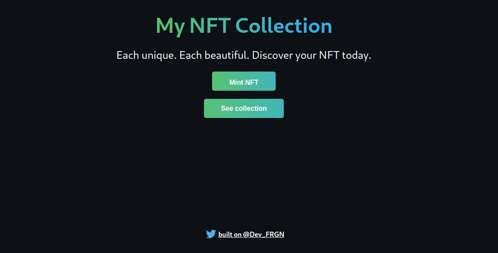

# Contract and NFT mint page
### Mint your own nft collection

### Welcome

You can see my dapp here : https://my-nfts.surge.sh/
To get started , clone this repo and follow these commands:

Run `npm install` at the root of your directory
Do `cd client` and run `npm install` again
Run `npm run start` to start the project

### Project

You'll see at `localhost:3000` :



Mint now your nft collection

### Training

Try running some of the following tasks for see how hardhat work :

```shell
npx hardhat accounts
npx hardhat compile
npx hardhat clean
npx hardhat test
npx hardhat node
node scripts/sample-script.js
npx hardhat help
```
